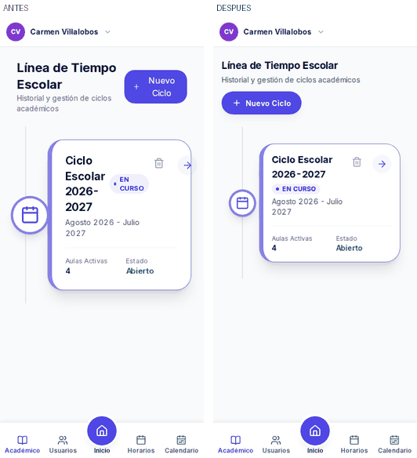
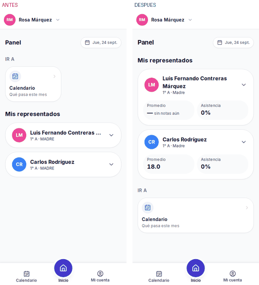
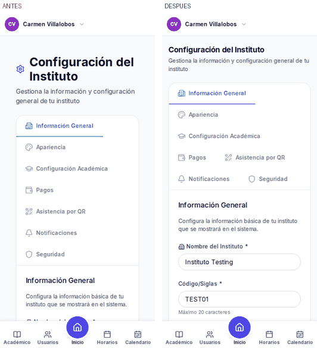
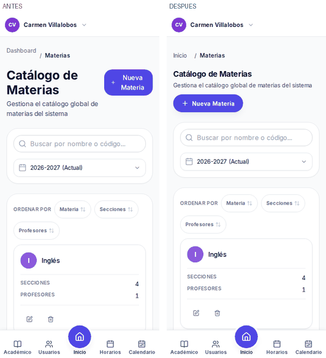
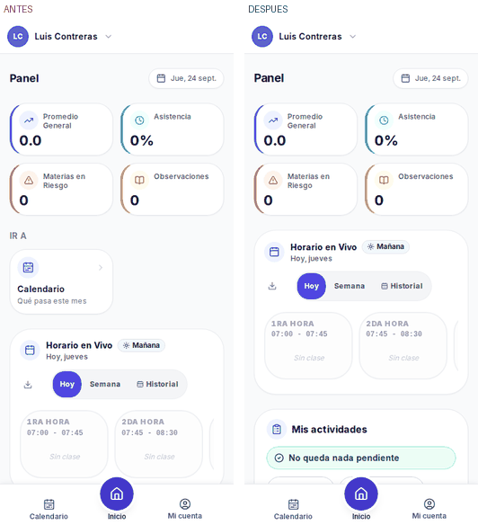
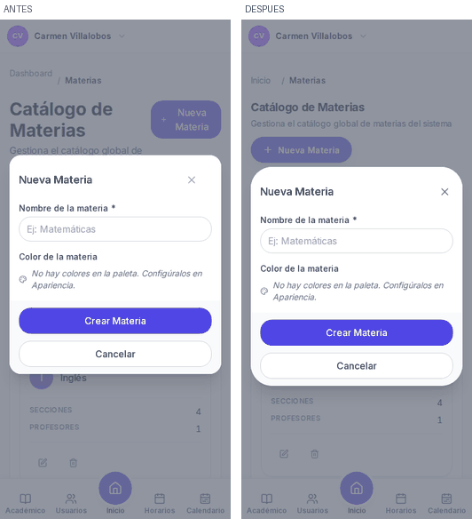

# Diseño: centrado, alineación, coherencia e intuición

## Para revisar

- **Rama:** `nube/diseno` (sale de `origin/nube/base`). Sin tocar `apps/backend`,
  `apps/movil`, la portada ni `.github/workflows`.
- **Commits** (del más viejo al más nuevo):
  - `e5f7971` docs: borrador del informe y línea base.
  - `76ccffc` prueba: `scripts/reglas-del-diseno.mjs`, `scripts/recorrido-del-diseno.mjs`
    y `tests/e2e/diseno-alineacion.spec.ts` (DISENO-01…06). Contra la web de antes, 5 de 6 en rojo.
  - `5f7e404` una sola cabecera de pantalla (`components/ui/encabezado-de-pantalla.tsx`),
    títulos en la misma columna y del mismo tamaño en 17 pantallas; fuera los márgenes dobles
    y los `<main>` metidos en otro `<main>`.
  - `168143e` Panel: el representante ve el promedio y la asistencia de cada hijo sin tocar
    nada; alumno y representante ven lo suyo antes que «Ir a»; baldosas alineadas.
  - `635fcba` Académico: la tarjeta del ciclo en curso ya no se sale del teléfono.
  - `483d803` Usuarios: la tabla cabe en la tableta y se lee al pasar el ratón (contraste).
  - `608cc4c` Ventanas: `role="dialog"` y nombre en todas, centradas en el teléfono, X de
    44 px que se llama «Cerrar».
- **Cómo probarlo** (con los dos servidores arriba, ver «Cómo se probó»):
  ```bash
  TEST_DB_URL=postgresql://postgres:<clave>@localhost:5432/tenant_instituto_testing \
    npx playwright test diseno-alineacion movil contraste
  npm run movil -- --exigir
  node scripts/recorrido-del-diseno.mjs --tam=telefono     # fotos + medidas en test-results/
  cd apps/web && npx jest && npm run typecheck
  ```
  Ojo: las pruebas de navegador usan cuentas que el sembrado del repositorio **no crea**
  (`admin@testing.edu.ve`, `est0575@…`, `tutor.prueba@…`). Ver «Notas del entorno».
- **En qué punto quedó:** primera vuelta hecha y en verde (DISENO-01…06, `movil --exigir`
  en 0 con 31 pantallas, contraste y MOVIL en verde, jest web 48/48, typecheck limpio).
  Sigue la segunda vuelta (lista de «Qué falta»).
- **Qué falta / qué queda por decidir:** ver las secciones del mismo nombre, al final.

## Antes y después (teléfono, 390 × 844)

| | |
|---|---|
|  |  |
|  |  |
|  |  |

## Qué estaba mal y qué le pasaba al liceo

Nada de esto daba un error ni ponía una prueba en rojo. Se veía «raro» y nadie sabía decir
por qué. Se midió con el DOM (`getBoundingClientRect`, estilos calculados), en 42 pantallas
× 7 tamaños (294 fotos), con el recorrido `scripts/recorrido-del-diseno.mjs`.

1. **Cada pantalla empezaba en un sitio distinto.** En el teléfono, el título del Panel
   estaba a 16 px del borde; el de Académico a 32, Aulas a 41, Configuración a 58 (con un
   icono delante), Eventos a 60. En el portátil el de Pagos empezaba 358 px más adentro que
   la columna. Motivo: nueve pantallas eran una página metida dentro de otra, con su propio
   fondo y su propio margen encima del margen del marco, y cuatro de ellas tenían un segundo
   `<main>` dentro del primero (el lector de pantalla anunciaba dos contenidos principales).
2. **Cuatro tamaños de título** (18, 20, 24 y 30 px) y cuatro azules para el botón principal.
3. **Botones partidos en dos líneas** en el teléfono: «Nuevo Ciclo», «Nueva Materia»,
   «Expandir todos», «Con Pendientes (Arrastre)»… con el icono flotando en medio.
4. **El representante no veía cómo iba su hijo.** Su panel empezaba por «Ir a» con una
   baldosa suelta (Calendario) a media fila; sus representados, plegados, decían
   «1° A · MADRE». El promedio y la asistencia **ya venían del servidor** y no se
   enseñaban. La tarea más importante del representante costaba un toque por hijo y, aun
   así, solo mostraba actividades.
5. **La tarjeta del ciclo en curso se salía del teléfono** (`scale-105`): la flecha de
   entrar quedaba cortada por el borde; el título se partía en cuatro líneas. La línea del
   tiempo no pasaba por el centro de los círculos.
6. **Veinticinco ventanas no se anunciaban como ventanas** (sin `role="dialog"`): quien usa
   lector de pantalla no se enteraba de que se había abierto algo. Seis más, hechas con la
   plantilla vieja de Tailwind UI, quedaban 32 px por encima del centro en el teléfono y su
   velo oscuro era un «botón» sin nombre que se podía enfocar. La X de cerrar medía 16, 20 o
   28 px, y la de los diálogos comunes se llamaba «Close», en inglés.
7. **La tabla de Usuarios se salía** en una tableta (862 px en 768) con un nombre largo, y
   al pasar el ratón por una fila la cédula quedaba en contraste 4,49:1 (el mínimo es 4,5).
   Las dos cosas fallaban ya en la línea base con estos datos (`MOVIL-03` y `contraste.spec`).
8. Detalles: «Dashboard» (en inglés) en las migas; Eventos decía «pasa el ratón por un
   bloque» a quien lo usa con el dedo; Pagos apagado cambiaba la cabecera por el aviso.

## Qué se arregló (con su commit)

| Qué | Commit | Prueba |
|---|---|---|
| Cabecera común: título en la columna y a 19/24 px; acciones que bajan de fila | `5f7e404` | DISENO-01, DISENO-02 |
| Sin márgenes dobles ni `<main>` anidados (9 pantallas) | `5f7e404` | DISENO-01 |
| Botones partidos en la cabecera y en filtros | `5f7e404` | DISENO-03 |
| Panel del representante y del alumno | `168143e` | DISENO-04, DISENO-05 |
| Tarjeta del ciclo en curso | `635fcba` | recorrido (foto) |
| Tabla de Usuarios (ancho y contraste) | `483d803` | MOVIL-03, contraste.spec |
| Ventanas: rol, nombre, centrado, X de 44 px | `608cc4c` | DISENO-06 |

## Qué se probó y qué no

**Probado, en verde al terminar esta vuelta:**

- `tests/e2e/diseno-alineacion.spec.ts`: 6/6 (antes, 5 de 6 en rojo).
- `npm run movil -- --exigir`: 0 incumplimientos en **31 pantallas** de los cuatro roles.
  (En la línea base solo midió 8: las cuentas de admin, alumno y representante no existían;
  ver «Notas del entorno».)
- `tests/e2e/movil.spec.ts` y `tests/e2e/contraste.spec.ts`: en verde (28 pruebas). En la
  línea base, con estos datos, MOVIL-03 y dos de contraste estaban en rojo; se comprobó
  levantando la web de antes en el puerto 3100.
- `apps/web`: `npx jest` 48/48, `npm run typecheck` sin errores, `next build` limpio.

**No probado:**

- La tanda completa de Playwright (198 pruebas): muchas dependen del sembrado grande del
  dueño (cuentas y datos que el repositorio no crea), así que en esta máquina el número no
  dice nada del producto. Se corrieron las que tocan lo cambiado.
- Pruebas de `apps/backend`: no se tocó. Línea base: 88 archivos en verde, 3 en rojo
  (`tenant-mismatch`, `orden-de-los-guardias`, `logo-en-la-base`) y la tanda se cayó
  (código 134) al llegar al 91 de 101. No es de esta sesión.
- Un teléfono de verdad y el modo oscuro de cada pantalla nueva (solo lo que mide
  `contraste.spec`).

## Notas del entorno (no son del producto)

- El contenedor no tiene IPv6 y el backend escucha en `'::'`: se levantó con un parche de
  entorno (`NODE_OPTIONS=--require ipv4.cjs`, fuera del repositorio) que cambia `'::'` por
  `'0.0.0.0'`.
- `@testing-library/react` 16 necesita `@testing-library/dom` y `npm ci --legacy-peer-deps`
  no la instala: `next build` fallaba en el chequeo de tipos de `GuideHistoryModal.test.tsx`.
  Se instaló con `--no-save`.
- Playwright pedía el Chromium 1234 y en la máquina estaba el 1194: enlace simbólico.
- **Las pruebas de navegador usan cuentas que no crea ningún sembrado del repositorio**
  (`admin@testing.edu.ve`, `est0575@testing.edu.ve`, `tutor.prueba@testing.edu.ve`). Se
  añadieron a mano en la base de esta máquina, con 32 alumnos de nombres largos en 1er Año A
  para medir listas largas. Sin eso, `npm run movil` solo mide al profesor y da verde.

## Qué queda por decidir

- ¿Se añade `@testing-library/dom` a `devDependencies` de `apps/web`? (sin ella no compila
  con `--legacy-peer-deps`).
- ¿Se añade al repositorio un sembrado con las cuentas que usan las pruebas de navegador?
  (lo haría la sesión de funcionamiento).
- El promedio del representado se pinta sin verde ni rojo, porque la nota que aprueba es de
  cada liceo y esa tarjeta no la recibe. Si el servidor la mandara en `/dashboard/tutor`
  (o un campo «aprobado»), se podría colorear sin fijar el 10.
- «0 %» de asistencia cuando aún no se ha pasado lista: el servidor no distingue «sin
  datos» de «0 %». Propuesta para la sesión de funcionamiento: mandar `null`.

## Qué falta (segunda vuelta, en curso)

- Recorrido «después» en los 7 tamaños y comparar cifras con el de antes.
- Medir las tareas de cada día (toques y pasos) en cada rol.
- Nombres de alumno cortados en la lista de la sección («Kleiver Josu…»).
- Etiquetas cortadas en las cifras («Promedio Sec…»).
- Clase en vivo: «Nueva Actividad» partido y el título de la tarjeta cortado.
- Ficha de alumno: un botón «Editar» que solo dice «no disponible en demo».
- Estados vacíos que no dicen qué hacer.

## Investigación y fuentes

- **WCAG 2.2**: 2.5.8 *Target Size (Minimum)* pide 24 × 24 px como mínimo; el proyecto ya
  exige 44 (Apple) y aquí se llevó también a la X de cada ventana. 2.4.11 *Focus Not
  Obscured*: lo enfocado no puede quedar tapado por barras fijas.
  [W3C WCAG 2.2](https://www.w3.org/TR/WCAG22/) ·
  [Deque, novedades de 2.2](https://dequeuniversity.com/resources/wcag-2.2/)
- **Estados vacíos**: deben decir qué pasa, enseñar qué va ahí y dar el siguiente paso con
  un botón. [NN/g, Designing Empty States](https://www.nngroup.com/articles/empty-state-interface-design/) ·
  [Carbon, Empty states](https://carbondesignsystem.com/patterns/empty-states-pattern/)
- **Portales de representantes**: lo que más se consulta es asistencia y notas, desde el
  teléfono, de un vistazo. Por eso el promedio y la asistencia van en la tarjeta de cada
  hijo, sin abrir nada.
  [Teach 'n Go, Parent portal](https://www.teachngo.com/blog/what-is-a-parent-portal) ·
  [Gradelink](https://gradelink.com/10-best-school-management-portals-and-login-systems/)
- **Liceos en Venezuela**: el año escolar va en tres lapsos y cada corte se comunica en un
  boletín; Control de Estudios emite boletines, constancias y certificaciones. De ahí el
  vocabulario que ya usa la app (lapso, sección, profesor guía, representante).
  [Colegio Santiago de León, Control de Estudios](https://cslc.edu.ve/courses/departamento-de-control-de-estudios/) ·
  [SciELO Venezuela, la evaluación en el sistema educativo](https://ve.scielo.org/scielo.php?script=sci_arttext&pid=S1316-49102008000100024)
- **Conexión y luz**: Venezuela está entre los internet móviles más lentos de la región y
  los cortes eléctricos tumban antenas; los datos son caros. Refuerza lo que el proyecto ya
  hace (sin señal se mira, no se toca) y pide pantallas que enseñen lo importante sin
  cargas extra.
  [El Nacional, internet móvil](https://www.elnacional.com/2024/12/venezuela-entre-los-paises-con-internet-movil-mas-lento-en-latinoamerica/) ·
  [Efecto Cocuyo, caídas por cortes](https://efectococuyo.com/la-humanidad/caida-de-conectividad-de-internet-por-falla-de-cantv-y-cortes-electricos/)
